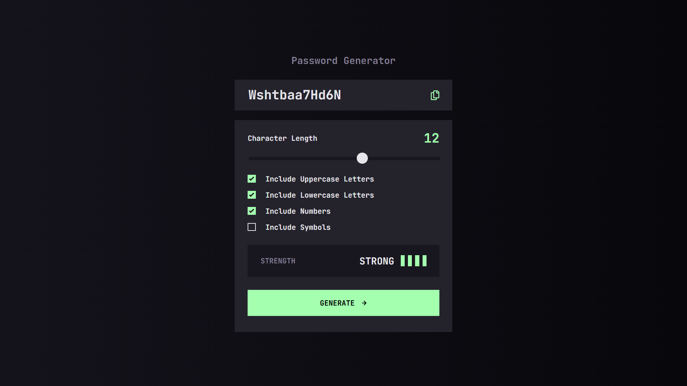

# Frontend Mentor - Password generator app solution

This is a solution to the [Password generator app challenge on Frontend Mentor](https://www.frontendmentor.io/challenges/password-generator-app-Mr8CLycqjh). 

## Table of contents

- [Overview](#overview)
  - [The challenge](#the-challenge)
  - [Screenshot](#screenshot)
  - [Links](#links)
- [My process](#my-process)
  - [Built with](#built-with)
  - [What I learned](#what-i-learned)
  - [Continued development](#continued-development)
  - [Useful resources](#useful-resources)
- [Author](#author)

## Overview

### The challenge

Users should be able to:

- Generate a password based on the selected inclusion options
- Copy the generated password to the computer's clipboard
- See a strength rating for their generated password
- View the optimal layout for the interface depending on their device's screen size
- See hover and focus states for all interactive elements on the page

### Screenshot



### Links

- Solution URL: [GitHub](https://github.com/g-akca/password-generator-app)
- Live Site URL: [Password Generator App](https://g-akca.github.io/password-generator-app/)

## My process

### Built with

- Semantic HTML5 markup
- CSS custom properties
- Flexbox
- CSS Grid
- Mobile-first workflow
- Media queries
- Dynamic JavaScript

### What I learned

I learned how to apply styles to a range input, keeping in mind that different browsers need different style indicators:

```css
#length::-webkit-slider-thumb {
    -webkit-appearance: none;
    appearance: none;
    margin-top: -11px;
    background-color: var(--grey-200);
    height: 28px;
    width: 28px;
    border-radius: 100%;
    transition: background-color 0.3s ease;
}

#length::-moz-range-thumb {
    border: none;
    background-color: var(--grey-200);
    height: 28px;
    width: 28px;
    border-radius: 100%;
    transition: background-color 0.3s ease;
}
```

It was also my first time copying an element to the user's clipboard through JavaScript:

```js
copyBtn.addEventListener("click", () => {
    password.select();
    password.setSelectionRange(0, 99999);
    navigator.clipboard.writeText(password.value);
    copiedText.classList.add("show");
});
```

### Continued development

I want to learn how to give range inputs a custom progress style (marked area to the left of the range thumb) on Chrome browsers. I found out how to do it on Firefox, but not Chrome.

### Useful resources

- [Creating A Custom Range Input That Looks Consistent Across All Browsers](https://www.smashingmagazine.com/2021/12/create-custom-range-input-consistent-browsers/) - This article helped me style the range input consistently. I will keep using this experience.
- [How To Copy to Clipboard](https://www.w3schools.com/howto/howto_js_copy_clipboard.asp) - I learned how to copy text to the user's clipboard through JavaScript.

## Author

- GitHub - [@g-akca](https://github.com/g-akca)
- Frontend Mentor - [@g-akca](https://www.frontendmentor.io/profile/g-akca)
